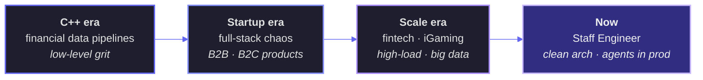

# Le Marc

**Staff Engineer · Full-stack · High-load systems**

*Complex problems, boring infrastructure, zero tolerance for demo-ware*

 

---

## About

**10 years** as Staff / Lead Engineer — from C++ financial data hammers to distributed systems at scale.

I build **high-load applications** with large datasets. Fintech, iGaming, B2B, B2C — domains where downtime costs money and "we'll fix it in the next sprint" isn't an option.

I don't just write code — I **design processes** that let teams ship faster without setting prod on fire.

---

## How I think about architecture

**Clean architecture** isn't a slide deck — it's how you keep a codebase alive when the team grows, the domain shifts, and someone new has to change prod on day three.

Domain logic stays domain logic. Infrastructure stays at the edges. Dependencies point inward. Not because Uncle Bob said so — because I've seen what happens when they don't.

Hexagonal, ports & adapters, bounded contexts — pick the vocabulary, the idea is the same: **make the hard parts testable and the easy parts replaceable**.

---

## How I think about AI

Most "AI products" are demos wearing a production badge. I don't do that.

I treat agents and workflows as **systems engineering** — same rules as any other service:

- clear boundaries and failure modes
- observability when the model goes off-script
- composable workflows, not prompt spaghetti
- integration into existing infra, not a parallel universe

The model is one component. The architecture around it is the job.

---

## Stack

<table>
<tr>
<td valign="top" width="50%">

**Languages & Runtimes**

`Rust` · `TypeScript` · `Haskell` · `Elixir` · `C++`

**Backend**

`Axum` · `NestJS` · Microservices · Event-driven

**Frontend**

`React` · `SolidJS` · `Svelte`

</td>
<td valign="top" width="50%">

**Data & Messaging**

`PostgreSQL` · `MySQL` · `MongoDB` · `ClickHouse`

`Kafka` · `RabbitMQ` · `NATS`

**Infra & Ops**

High-load architecture · Process design · Team leadership

</td>
</tr>
</table>

---

## The path here

---

**GitHub is a signpost → [github.com/lemarco](https://github.com/lemarco)**

*All repos live here. All commits happen here.*

